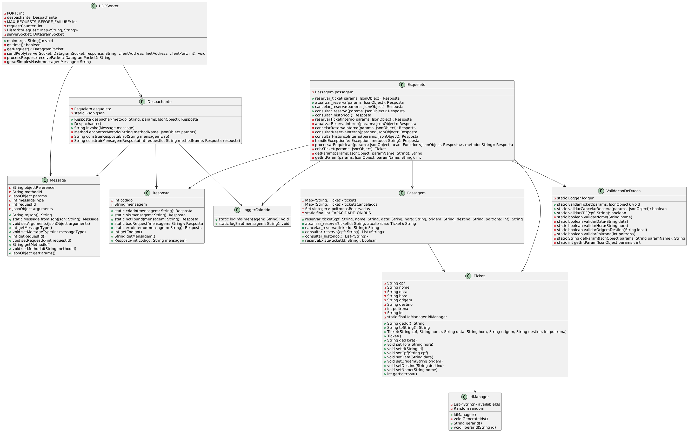

# Passagens de Ônibus - Sistema de Reservas

Este sistema permite que os usuários reservem, atualizem e cancelem passagens de ônibus. Aqui está um guia completo para entender o funcionamento e como executar o projeto.

## Índice

1. Descrição do Projeto
2. UML do server
3. Funcionalidades Principais
4. Componentes do Sistema
5. Como Executar o Projeto

## Descrição do Projeto

O sistema de reservas de passagens de ônibus foi desenvolvido para facilitar a gestão de reservas, atualizações e cancelamentos de passagens. Ele utiliza comunicação via UDP para receber e processar requisições dos clientes, esse projeto faz parte do trabalho final da cadeira de Sistemas Distribuídos.

## Fluxograma

## Funcionalidades Principais

1. **Reserva de Passagens**:
   - Os usuários podem reservar uma passagem informando dados como CPF, nome, data, hora, origem, destino e número da poltrona.

2. **Atualização de Reservas**:
   - É possível atualizar informações de uma reserva existente, como alterar a data ou o destino.

3. **Cancelamento de Reservas**:
   - Os usuários podem cancelar uma reserva previamente feita.

4. **Consulta de Reservas**:
   - O sistema permite consultar as reservas feitas anteriormente.

5. **Histórico de Reservas**:
   - Os usuários podem verificar o histórico de suas reservas.

## Componentes do Sistema

- **UDPServer**:
  - Responsável por receber e processar as requisições via UDP.
  - **Atributos**:
    - `PORT`: Porta do servidor.
    - `despachante`: Instância do Despachante.
    - `MAX_REQUESTS_BEFORE_FAILURE`: Número máximo de requisições antes de falhar.
    - `requestCounter`: Contador de requisições.
    - `HistoricoRequest`: Histórico de requisições.
    - `serverSocket`: Socket do servidor.
  - **Métodos**:
    - `main(args: String[])`: Método principal para iniciar o servidor.
    - `qt_time()`: Verifica se é hora de parar.
    - `getRequest()`: Recebe uma requisição.
    - `sendReply(serverSocket: DatagramSocket, response: String, clientAddress: InetAddress, clientPort: int)`: Envia uma resposta.
    - `processRequest(receivePacket: DatagramPacket)`: Processa uma requisição.
    - `gerarSimplesHash(message: Message)`: Gera um hash simples para a mensagem.

- **Despachante**:
  - Encaminha as requisições para o esqueleto apropriado.
  - **Atributos**:
    - `esqueleto`: Instância do Esqueleto.
    - `gson`: Instância do Gson para manipulação de JSON.
  - **Métodos**:
    - `despachar(metodo: String, params: JsonObject)`: Despacha a requisição.
    - `invoke(Message message)`: Invoca o método apropriado.
    - `encontrarMetodo(String methodName, JsonObject params)`: Encontra o método a ser chamado.
    - `construirRespostaErro(String mensagemErro)`: Constrói uma resposta de erro.
    - `construirMensagemResposta(int requestId, String methodName, Resposta resposta)`: Constrói a mensagem de resposta.

- **Esqueleto**:
  - Implementa as funcionalidades específicas (reserva, atualização, cancelamento, consulta).
  - **Atributos**:
    - `passagem`: Instância da classe Passagem.
  - **Métodos**:
    - `reservar_ticket(params: JsonObject)`: Reserva um ticket.
    - `atualizar_reserva(params: JsonObject)`: Atualiza uma reserva.
    - `cancelar_reserva(params: JsonObject)`: Cancela uma reserva.
    - `consultar_reserva(params: JsonObject)`: Consulta uma reserva.
    - `consultar_historico()`: Consulta o histórico de reservas.
    - `handleException(e: Exception, metodo: String)`: Lida com exceções.
    - `processarRequisicao(params: JsonObject, acao: Function<JsonObject, Resposta>, metodo: String)`: Processa uma requisição.
    - `criarTicket(params: JsonObject)`: Cria um ticket.
    - `getParam(params: JsonObject, paramName: String)`: Obtém um parâmetro.
    - `getIntParam(params: JsonObject, paramName: String)`: Obtém um parâmetro inteiro.

- **Passagem**:
  - Mantém os dados das passagens, histórico e poltronas reservadas.
  - **Atributos**:
    - `tickets`: Mapa de tickets.
    - `ticketsCancelados`: Mapa de tickets cancelados.
    - `poltronasReservadas`: Conjunto de poltronas reservadas.
    - `CAPACIDADE_ONIBUS`: Capacidade do ônibus.
  - **Métodos**:
    - `reservar_ticket(cpf: String, nome: String, data: String, hora: String, origem: String, destino: String, poltrona: int)`: Reserva um ticket.
    - `atualizar_reserva(ticketId: String, atualizacao: Ticket)`: Atualiza uma reserva.
    - `cancelar_reserva(ticketId: String)`: Cancela uma reserva.
    - `consultar_reserva(cpf: String)`: Consulta uma reserva.
    - `consultar_historico()`: Consulta o histórico de reservas.
    - `reservaExiste(ticketId: String)`: Verifica se a reserva existe.

- **Resposta**:
  - Define as respostas padrão para as requisições.
  - **Atributos**:
    - `codigo`: Código da resposta.
    - `mensagem`: Mensagem da resposta.
  - **Métodos**:
    - `criado(mensagem: String)`: Resposta de criação.
    - `ok(mensagem: String)`: Resposta de sucesso.
    - `notFound(mensagem: String)`: Resposta de não encontrado.
    - `badRequest(mensagem: String)`: Resposta de requisição inválida.
    - `erroInterno(mensagem: String)`: Resposta de erro interno.

- **Validação de Dados**:
  - Realiza validações nos dados recebidos.
  - **Atributos**:
    - `logger`: Logger para mensagens de validação.
  - **Métodos**:
    - `validarTicket(params: JsonObject)`: Valida um ticket.
    - `validarCancelarReserva(params: JsonObject)`: Valida o cancelamento de uma reserva.
    - `validarCPF(cpf: String)`: Valida o CPF.
    - `validarNome(nome: String)`: Valida o nome.
    - `validarData(data: String)`: Valida a data.
    - `validarHora(hora: String)`: Valida a hora.
    - `validarOrigemDestino(local: String)`: Valida a origem/destino.
    - `validarPoltrona(poltrona: int)`: Valida o número da poltrona.
    - `getParam(JsonObject params, String paramName)`: Obtém um parâmetro.
    - `getIntParam(JsonObject params)`: Obtém um parâmetro inteiro.

- **IdManager**:
  - Gerencia os IDs das passagens.
  - **Atributos**:
    - `availableIds`: Lista de IDs disponíveis.
    - `random`: Instância de Random para gerar IDs.
  - **Métodos**:
    - `IdManager()`: Construtor.
    - `GenerateIds()`: Gera os IDs.
    - `gerarId()`: Gera um ID.
    - `liberarId(String id)`: Libera um ID.

## Como Executar o Projeto

1. Clone o repositório para sua máquina local.
2. Abra o projeto em sua IDE preferida.
3. Execute o servidor `UDPServer`.
4. Envie requisições para o servidor via UDPCliente.
